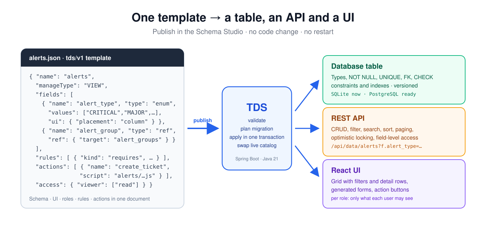
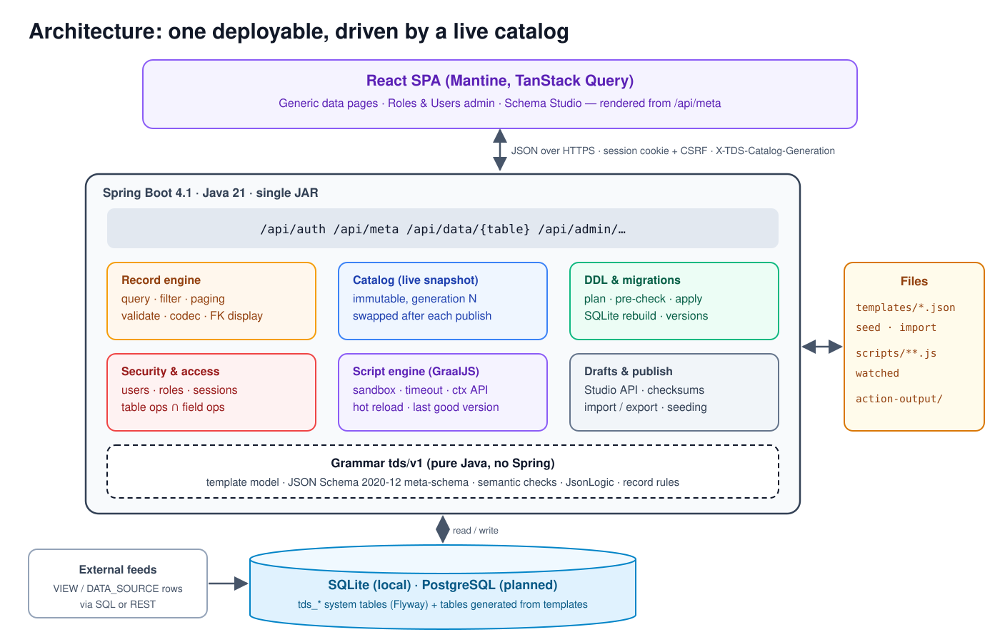
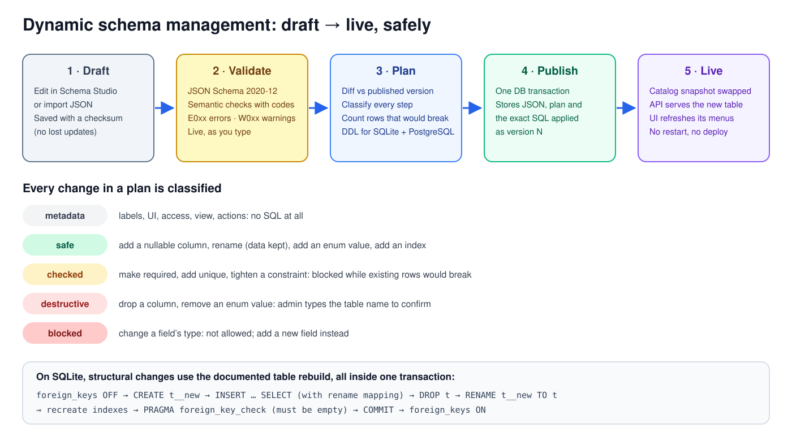
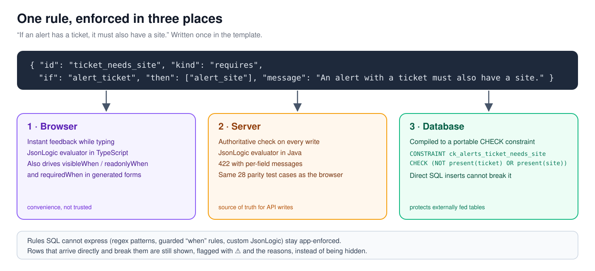
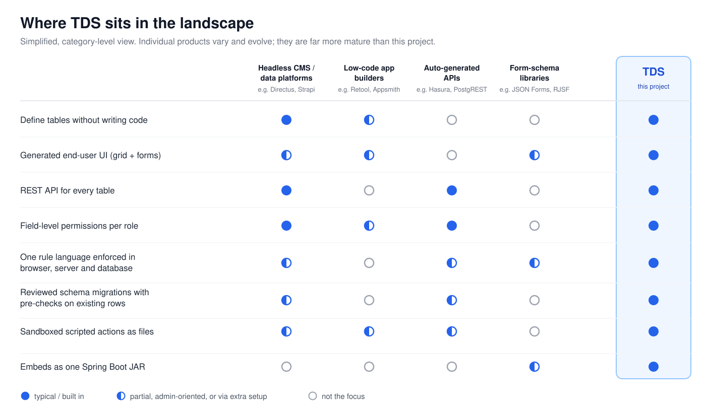

# templated_data_service

Quick service to view and manage data through a UI and serve it through an API.
The data and the UI are defined as a data template, and the service is ready
without any code change.

**Templated Data Service (TDS):** define a table, its UI, role permissions and
actions in one JSON template. TDS creates the database table, a REST API and a
React UI for it, with no code change and no restart.



## How it works

**Architecture.** One Spring Boot JAR serves the API and the React app. Requests
read an immutable catalog of published templates; publishing swaps in a new one,
so changes go live without a restart.



**Dynamic schema management.** Drafts are validated, every change in the
migration plan is classified and pre-checked against existing rows, and each
publish runs in one transaction and is stored as a new version.



**One rule, three enforcement points.** Rules written once in the template run
in the browser, on the server and, where SQL can express them, as database
`CHECK` constraints.



**Where it fits.** A simplified, category-level comparison with established
tools, which are far more mature than this project.



## Documentation

| Doc | What |
|---|---|
| [docs/01-schema-grammar.md](docs/01-schema-grammar.md) | Template grammar `tds/v1` |
| [docs/02-architecture.md](docs/02-architecture.md) | Architecture |
| [docs/03-application-design.md](docs/03-application-design.md) | Class-level design (+ §15 implementation notes) |
| [docs/04-development-plan.md](docs/04-development-plan.md) | Backlog, milestone status, known gaps |
| [docs/adr/](docs/adr/README.md) | Architecture decision records (every requirement or design change) |
| [studio-prototype/schema-studio.html](studio-prototype/schema-studio.html) | Original Schema Studio prototype (reference only) |

## Prerequisites

- JDK 21 and Maven 3.9+
- Node 22+ only for UI development (the `-Pui` build downloads its own Node into `target/node`)

Git Bash (no spaces around `=`). JDK 21 must also come first on `PATH` if another `java` is installed:

```bash
export JAVA_HOME="/path/to/jdk-21"    # your JDK 21 install folder
export PATH="$JAVA_HOME/bin:$PATH"
java --version        # expect 21.x
```

PowerShell: `$env:JAVA_HOME = "C:\path\to\jdk-21"; $env:Path = "$env:JAVA_HOME\bin;$env:Path"`

## Build

```bash
mvn -Pui verify      # builds ui/ into the jar, runs backend unit + integration tests
mvn verify           # backend only (faster)
cd ui && npm test    # UI tests (Vitest)
```

## Try it (dev profile: seed tables published, sample rows loaded)

Run from the project folder, so `templates/` and `scripts/` are found:

```bash
export TDS_ADMIN_PASSWORD=change-me-now-1      # PowerShell: $env:TDS_ADMIN_PASSWORD = "change-me-now-1"
java -jar target/templated-data-service-0.1.0-SNAPSHOT.jar --spring.profiles.active=dev
```

Open http://localhost:8080 and sign in as **admin** with that password; you'll
be asked to choose your own. Without `TDS_ADMIN_PASSWORD`, a generated password
is written to the log once.

What to try:

| Where | What |
|---|---|
| **Alerts** (VIEW) | Read-only grid: sort by header, filter by type, group or date, search, expand a row for details. The ⚠ row is a CRITICAL alert with no description (inserted directly, so it breaks an app-level rule). **Create ticket** runs `scripts/alerts/create_ticket.js` and shows copy-ready text plus a download. |
| **Vendor Items** (MANAGE_VIEW) | **+ New / Edit / Delete** with validation: required fields, wattage ≥ 0, and a unique vendor + item pair. |
| **Administration → Alert Groups** | Admin data browser for the DATA_SOURCE lookup. Deleting a group that alerts still use is refused. |
| **Roles / Users** | Create a role, create a user with that role (temporary password, changed at first sign-in), reset passwords, disable users. |
| **Schema Studio** | Edit a template (fields, rules, actions with a live script editor, access matrix, view, JSON), **Save draft**, **Publish…** to review the migration plan, pre-checks and DDL, then apply. Create a **+ New template**: after publishing, it's in the navigation immediately. |

Edit `scripts/**/*.js` while the service runs: changes reload automatically.
A broken edit keeps the last good version.

To start over, stop the service and delete the `data/` folder (SQLite database
and action output).

## UI development

```bash
mvn spring-boot:run -Dspring-boot.run.profiles=dev   # API on :8080
cd ui && npm install && npm run dev                  # UI on :5173, proxies /api to :8080
```

## Layout

```
src/main/java/io/github/aishwaryajayanth1820/tds   backend: grammar, ddl, catalog, data, access, script, meta, admin, security, web, jdbc, config
src/main/resources          application*.yml, Flyway scripts per vendor
ui/                         React + Mantine app: data pages, admin, Schema Studio
schema/                     tds-template.schema.json (grammar meta-schema, shared by server and Studio)
docs/images/                diagrams (SVG) used in this README
templates/                  seed templates; sample-data/ rows for the dev profile
scripts/                    action scripts (loaded at startup, hot-reloaded)
testdata/parity/            JsonLogic test cases shared by JUnit and Vitest
```
