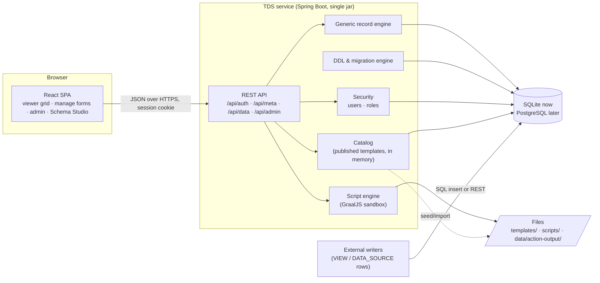
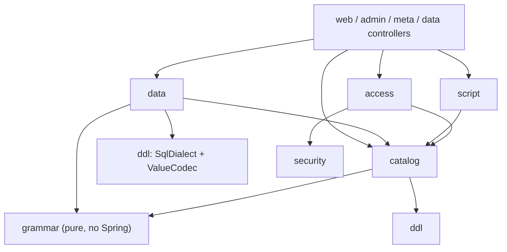
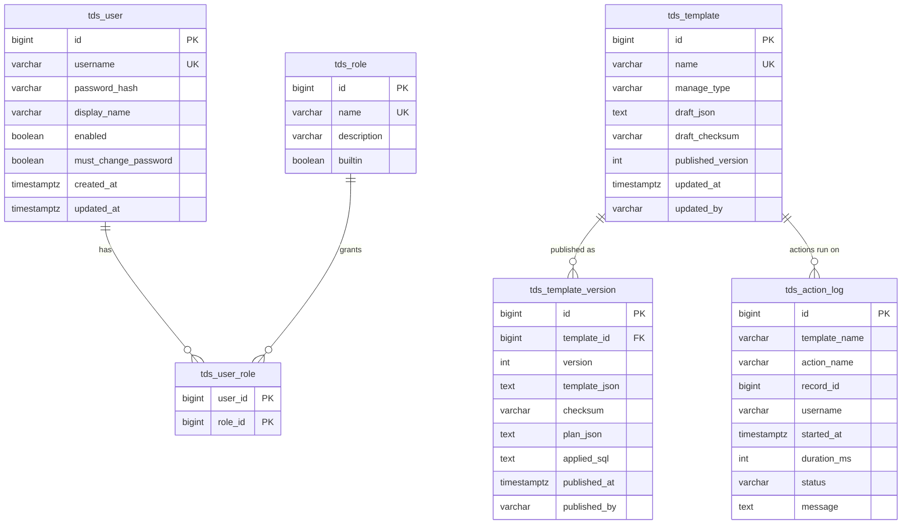
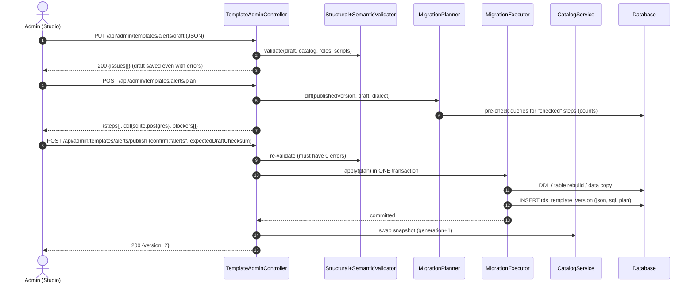
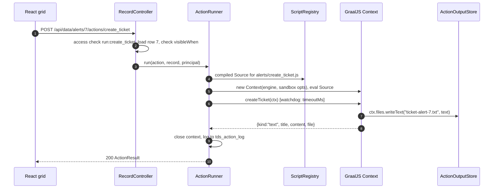

# TDS Architecture & Application Design

Status: **Draft for review** · Owner: Zypher / Aabel · 2026-10-03
Builds on: [01-schema-grammar.md](01-schema-grammar.md) (accepted) and the Schema Studio prototype (accepted).
Decisions and later changes: [ADR log](adr/README.md).

---

## 1. Goals and constraints

| # | Requirement | How the design meets it |
|---|---|---|
| R1 | A template creates a table, REST API and React UI **with no code change** | Templates are data. Publishing one swaps an in-memory catalog; the generic REST layer and the generic React UI both render from that catalog. No restart, no build. |
| R2 | Tabular view UI once data exists | Generic grid driven by `/api/meta`, with search, filters, sort, paging and expandable detail rows |
| R3 | Injectable JavaScript actions, stored in files, loaded on (re)start | `ScriptRegistry` loads `scripts/**.js` at startup and watches the folder. Actions run in a GraalJS sandbox. |
| R4 | Roles managed separately; admin assigns them to users; username + password | `tds_user`, `tds_role`, `tds_user_role`; Spring Security session login with BCrypt |
| R5 | `VIEW` / `MANAGE_VIEW` / `DATA_SOURCE` semantics | Enforced in `/api/meta` (which UI to offer); REST CRUD exists for every type, gated only by role |
| R6 | REST API for add / update / delete on every table; the UI uses only that API | `/api/data/{template}/**`; the React app has no other data path |
| R7 | SQLite first, PostgreSQL-compatible, migrate later | `SqlDialect` abstraction, portable DDL (§6), Flyway per-vendor folders, and a planned copy tool (§13) |
| R8 | Java 21, Spring Boot | Spring Boot **4.1.1** (Java 17–26), compiled with `--release 21` and run on any JDK 21 |

**Non-goals for v1:** multiple service instances, multi-tenancy, SSO/LDAP, field-level audit history, composite primary keys.

---

## 2. Technology choices

| Concern | Choice | Version | Why |
|---|---|---|---|
| Runtime | Spring Boot (Spring Framework 7) | 4.1.1 | Current stable; Java 21 supported; Jackson 3 by default |
| DB access | Spring `JdbcClient` / `NamedParameterJdbcTemplate` | Boot-managed | Tables are created at runtime, so JPA entities can't exist for them. One access style for everything. |
| System schema migrations | Flyway (SQLite support is in `flyway-core`) + `flyway-database-postgresql` | 12.4.0 (Boot-managed) | Per-vendor scripts in `db/migration/{vendor}` |
| SQLite driver | `org.xerial:sqlite-jdbc` | 3.53.2.1 (Boot-managed) | |
| PostgreSQL driver | `org.postgresql:postgresql` | Boot-managed | For later migration |
| Template structure validation | `com.networknt:json-schema-validator` | 3.0.x (Jackson 3 line) | Validates against the same `schema/tds-template.schema.json` used by the Studio |
| Rules | In-house JsonLogic evaluator (operator subset + `present`), mirrored in TS | — | Exact parity with the browser; compiled once ([ADR-0003](adr/0003-jsonlogic-in-house-evaluators.md)) |
| Scripts | `org.graalvm.polyglot:polyglot` + `js-community` | 25.4.x (bytecode targets Java 17, verified) | Sandboxed JavaScript inside the JVM |
| Security | Spring Security 7 | Boot-managed | Session login with BCrypt |
| Frontend | React + TypeScript + Vite | 19.3 / 7.0 / 8.3 | |
| UI kit | Mantine | 9.x | Complete form and overlay set, light/dark themes, MIT licence |
| Grid | TanStack Table (headless) | 9.x | Server-side sort, filter and paging; we own the look |
| Server state | TanStack Query | 5.x | Caching, invalidation after writes |
| Routing | React Router | 8.x | |
| Editors (Studio) | Monaco via `@monaco-editor/react`, lazy-loaded | 4.7 | JSON with schema autocomplete, JS editing |
| Client validation | `ajv` (2020-12) + in-house `jsonlogic.ts` | 8.20 | Instant feedback. The server stays authoritative ([ADR-0003](adr/0003-jsonlogic-in-house-evaluators.md)). |
| Build | Maven 3.9 + `frontend-maven-plugin` (Node 22) | | One command produces one jar |
| Tests | JUnit 5, Spring Boot Test, Vitest, Playwright (later), Testcontainers PostgreSQL (§13) | | |

> **GraalJS on stock JDK 21:** without the Graal JIT, the polyglot engine runs in
> interpreter mode. That's fine for short action scripts, and we set
> `-Dpolyglot.engine.WarnInterpreterOnly=false`. If scripts ever get heavy, run the
> service on GraalVM for JDK 21. No code changes are needed.

---

## 3. System context



One deployable: the React build is served by Spring Boot from `classpath:/static`.
In development, Vite (`:5173`) proxies `/api` to Spring Boot (`:8080`).

---

## 4. Repository and runtime layout

```
templated_data_service/
├─ pom.xml                         Spring Boot app; -Pui also builds ui/ into static/
├─ src/main/java/io/github/aishwaryajayanth1820/tds/…     backend (§5)
├─ src/main/resources/
│  ├─ application.yml              common config
│  ├─ application-dev.yml          SQLite, seed auto-publish, verbose SQL
│  ├─ application-postgres.yml     PostgreSQL datasource
│  ├─ db/migration/sqlite/V1__system.sql
│  └─ db/migration/postgresql/V1__system.sql
├─ src/test/…                      unit + integration tests
├─ ui/                             Vite + React + TS app (§10)
├─ schema/tds-template.schema.json grammar meta-schema (copied to classpath at build)
├─ templates/*.json                seed / import / export
├─ scripts/**.js                   action scripts (runtime, hot-reloaded)
├─ testdata/                       parity vectors shared by JUnit and Vitest (§12)
├─ docs/                           this design set
├─ studio-prototype/               accepted UI prototype (reference)
└─ data/                           git-ignored: tds.db, action-output/
```

Every runtime folder is configurable:

```yaml
tds:
  paths:
    templates: ./templates
    scripts: ./scripts
    output: ./data/action-output
  seed:
    import-on-start: true        # import new/changed template files as drafts
    auto-publish: false          # dev profile sets true
  scripts:
    watch: true
    max-concurrent: 8
    default-timeout-ms: 3000
  security:
    bootstrap-admin: admin       # created on first start if no users exist
spring:
  datasource:
    url: jdbc:sqlite:./data/tds.db
```

---

## 5. Backend module design

Package root `io.github.aishwaryajayanth1820.tds`. Each package exposes a small service API and keeps
its internals package-private.



| Package | Responsibility | Key types |
|---|---|---|
| `grammar` | The `tds/v1` model and its checks. Pure Java with no Spring or DB dependency, so it's easy to unit-test. | `Template`, `Field`, `FieldType`, `RefSpec`, `EnumValue`, `Constraints`, `FieldUi`, `Rule` (sealed: `Requires`, `Exclusive`, `AtLeastOne`, `Expr`), `ActionSpec`, `ViewSpec`, `TemplateParser`, `StructuralValidator` (networknt), `SemanticValidator` (E0xx/W0xx codes, same as the Studio), `Issue`, `JsonLogicEngine` |
| `catalog` | Template lifecycle (draft, validate, plan, publish), versions, and the runtime snapshot | `CatalogService`, `CatalogSnapshot`, `CompiledTemplate`, `TemplateRepository`, `PublishService`, `TemplateSeeder` |
| `ddl` | Dialect-specific SQL, DDL generation, diffing, migration execution, drift checks | `SqlDialect` (`SqliteDialect`, `PostgresDialect`), `DdlGenerator`, `MigrationPlanner`, `MigrationStep`, `MigrationExecutor`, `SchemaInspector`, `ValueCodec` |
| `data` | Generic CRUD, query, validation and lookups for any published template | `RecordController`, `RecordService`, `RecordQuery`, `QueryBuilder`, `RecordValidator`, `LookupService` |
| `access` | Who may do what to which template and field | `AccessEvaluator`, `Principal` (username + effective roles) |
| `security` | Users, roles, login, bootstrap | `SecurityConfig`, `AuthController`, `UserRepository`, `RoleRepository`, `TdsUserDetailsService`, `BootstrapAdmin` |
| `script` | Loading, watching and running action scripts | `ScriptRegistry`, `ScriptFile`, `ScriptWatcher`, `ActionRunner`, `ActionContextFactory`, `ActionResult`, `ActionOutputStore`, `ActionLogRepository` |
| `meta` | Per-user UI metadata the React app renders from | `MetaController`, `MetaAssembler` |
| `admin` | Schema Studio, roles, users and scripts admin APIs | `TemplateAdminController`, `RoleAdminController`, `UserAdminController`, `ScriptAdminController` |
| `web` | Error mapping, SPA routing | `ApiExceptionHandler` (RFC 9457 `ProblemDetail`), `SpaForwardController` |
| `config` | Properties and wiring | `TdsProperties`, `DataSourceConfig` (SQLite pragmas), `JacksonConfig` |

### 5.1 The catalog snapshot (how "no code change" works)

```java
public record CatalogSnapshot(long generation, Map<String, CompiledTemplate> byName) { … }

public final class CompiledTemplate {
  Template model;                       // parsed tds/v1
  int version;
  List<Field> orderedFields;            // by ui.order
  Map<String, Field> fieldIndex;        // request field names are resolved here only
  String selectColumns;                 // pre-built, quoted from validated names
  Map<String, CompiledLogic> logic;     // requiredWhen / visibleWhen / rules, parsed once
  Map<String, ActionSpec> actions;
  List<RefInfo> outgoingRefs, incomingRefs;
}
```

- `CatalogService` holds a `volatile CatalogSnapshot`. Every request reads the
  current snapshot once and uses it throughout, so a publish can't swap it
  halfway through a request.
- `PublishService` builds a new snapshot. It swaps it in **only after** the
  migration transaction commits. If the transaction fails, the old snapshot keeps
  serving.
- The React app asks `/api/meta` again after it sees a newer `catalogGeneration`
  (returned in a response header on every API call).

---

## 6. Data model

### 6.1 System tables (Flyway, prefix `tds_`)



- `tds_template.draft_json` is the editable draft (what Studio edits).
  `tds_template_version` holds the history of published versions. It's
  append-only and records the exact SQL that was applied.
- Built-in roles `admin` and `viewer` are seeded by Flyway (`builtin = true`, so
  they can't be deleted). `viewer` is never stored per user; every authenticated
  user has it implicitly.
- `tds_action_log` records every action run (status `OK`, `ERROR` or `TIMEOUT`)
  for troubleshooting and audit.

### 6.2 Managed tables

These are generated from templates exactly as specified in grammar §4.1. Every
managed table gets the audit columns and `row_version` unless the template turns
them off.

### 6.3 Value encoding (`ValueCodec`)

| Logical type | Java | SQLite storage | PostgreSQL | JSON over the API |
|---|---|---|---|---|
| `datetime` | `Instant` | TEXT `yyyy-MM-dd'T'HH:mm:ss.SSS'Z'` (always millis, so it sorts as text) | `TIMESTAMPTZ` | `"2026-10-03T09:42:00.000Z"` |
| `date` | `LocalDate` | TEXT `yyyy-MM-dd` | `DATE` | `"2026-10-03"` |
| `time` | `LocalTime` | TEXT `HH:mm:ss` | `TIME` | `"08:30:00"` |
| `boolean` | `Boolean` | INTEGER 0/1 | `BOOLEAN` | `true` |
| `decimal` | `BigDecimal` | NUMERIC (\*) | `NUMERIC(p,s)` | number |
| `json` | `JsonNode` | TEXT | `JSONB` | object |
| `ref` | `Long` | INTEGER | `BIGINT` | `4` plus `"<field>$display": "Network"` |

(\*) SQLite's NUMERIC type stores numbers as floating point, so it is exact only to
about 15 significant digits. That's acceptable for local development; PostgreSQL
is exact.

### 6.4 SQLite connection settings

Applied by `DataSourceConfig` on every connection: `journal_mode=WAL`,
`foreign_keys=ON`, `busy_timeout=5000`, `synchronous=NORMAL`. The Hikari pool is
small (4). SQLite allows one writer at a time, and `busy_timeout` makes other
writers wait their turn.

---

## 7. Template lifecycle (Studio → live)



- **Concurrency:** publishing is serialised by a JVM lock. `expectedDraftChecksum`
  stops a stale Studio tab from publishing someone else's edits.
- **Pre-checks** (for steps classed `checked`) count the rows that would break
  the change. Any count above zero blocks the publish and is reported, for
  example: "37 rows have NULL in `site_code`".
- **SQLite table rebuild**, which SQLite needs to change constraints, follows the
  official 12-step procedure:
  1. `PRAGMA foreign_keys=OFF` on a dedicated connection (it can't be changed
     inside a transaction).
  2. `BEGIN`, create `t__new`, run `INSERT … SELECT` with column mapping
     (handles renames and drops), drop `t`, rename `t__new` to `t`, then recreate
     the indexes.
  3. `PRAGMA foreign_key_check`. Any result rolls back.
  4. `COMMIT`, then `PRAGMA foreign_keys=ON`.
- **PostgreSQL** runs plain `ALTER TABLE …` statements. DDL is transactional on
  both engines, so a failed publish leaves nothing half-applied.
- **Drift check at startup:** `SchemaInspector` compares each published template
  with the actual columns (via JDBC metadata) and logs WARN on mismatches, for
  example after manual DB edits.

---

## 8. REST API

All bodies are JSON. Errors use RFC 9457 `ProblemDetail`:

```json
{ "type": "about:blank", "title": "Validation failed", "status": 422, "code": "VALIDATION",
  "errors": { "alert_description": "Required" }, "general": ["An alert with a ticket must also have a site."] }
```

### 8.1 Auth & metadata

| Method | Path | Notes |
|---|---|---|
| POST | `/api/auth/login` | `{username, password}` → session cookie (HttpOnly, SameSite=Lax) |
| POST | `/api/auth/logout` | |
| GET | `/api/auth/me` | `{username, displayName, roles[]}` |
| POST | `/api/auth/password` | change own password |
| GET | `/api/meta` | Navigation: templates the user can read, filtered to `VIEW` / `MANAGE_VIEW` (admin also sees `DATA_SOURCE` in a data browser) |
| GET | `/api/meta/{template}` | A per-user subset of the template: readable fields, field ops (`read`, `create`, `update`), runnable actions, view config, rules and conditions for client-side validation, `canCreate`, `canUpdate`, `canDelete`. **Fields the user can't read are never sent.** |

### 8.2 Data (every template, every manage type)

| Method | Path | Permission |
|---|---|---|
| GET | `/api/data/{t}?page=0&size=25&sort=alert_date,desc&q=edge&f.alert_type=CRITICAL&f.alert_date.gte=2026-10-01` | `read` |
| GET | `/api/data/{t}/{id}` | `read` |
| POST | `/api/data/{t}` | `create`. Only fields with field-level `create` are accepted; others → 422 |
| PUT | `/api/data/{t}/{id}` | `update`. Body must carry `row_version` (optimistic lock; a mismatch → 409) |
| PATCH | `/api/data/{t}/{id}` | `update`, partial |
| DELETE | `/api/data/{t}/{id}` | `delete`. FK `RESTRICT` violation → 409 with the referencing table named |
| GET | `/api/data/{t}/fields/{f}/options?q=net` | `read` on `{t}` → `[{id, label}]` for `ref` lookups |
| POST | `/api/data/{t}/{id}/actions/{a}` | `run:{a}` (row action) |
| POST | `/api/data/{t}/actions/{a}` | `run:{a}`, body `{ids:[…]}` (selection) or `{}` (toolbar) |
| GET | `/api/data/{t}/action-output/{file}` | `read`; downloads a file written by `ctx.files.writeText` |

**List response:** `{ "items": [...], "page": 0, "size": 25, "total": 120 }`.

**Filter operators:** `f.<field>` (equals), `.ne`, `.gt`, `.gte`, `.lt`, `.lte`,
`.in` (comma-separated), `.like`, `.null` (`true`/`false`). Free-text `q` is an
`OR` of case-insensitive `LIKE` over `view.search` (`ILIKE` on PostgreSQL).

**Write pipeline** (`RecordService`):
1. Resolve the template from the snapshot. Unknown name → 404.
2. Check the table permission, then strip or reject fields by field-level permission.
3. Decode each value with `ValueCodec`. A type mismatch → 422.
4. Apply defaults (`now`, `today`, `uuid`, `currentUser`) on create.
5. Run `RecordValidator`: required, `requiredWhen`, constraints and rules. These
   are the same semantics as the browser, guaranteed by parity tests (§12).
6. Fill audit columns and `row_version`.
7. Run parameterised SQL. Map DB constraint errors to 409 or 422 with a readable
   message.

**SQL safety:** table and column identifiers only ever come from the catalog,
where names were checked against `^[a-z][a-z0-9_]{0,62}$`. Request strings are
only *looked up* there. Every value is a bind parameter.

### 8.3 Admin (`admin` role only)

| Method | Path | Purpose |
|---|---|---|
| GET | `/api/admin/templates` | list with status (draft / published vN / pending changes) |
| GET/PUT | `/api/admin/templates/{t}/draft` | read / save draft. Response includes `issues[]` |
| POST | `/api/admin/templates` | create a new draft |
| POST | `/api/admin/templates/{t}/validate` | issues only |
| POST | `/api/admin/templates/{t}/plan` | migration steps, pre-check counts, DDL for both dialects |
| POST | `/api/admin/templates/{t}/publish` | apply the plan (see §7) |
| GET | `/api/admin/templates/{t}/versions[/{v}]` | history |
| POST | `/api/admin/templates/import` · GET `/{t}/export` | file round-trip |
| DELETE | `/api/admin/templates/{t}` | delete a draft. Dropping a published table needs `?drop=true&confirm={t}` |
| GET/POST/PUT/DELETE | `/api/admin/roles[/{r}]` | built-ins can't be deleted; a role in use can't be deleted |
| GET/POST/PUT | `/api/admin/users[/{u}]` | create, enable or disable, reset password |
| PUT | `/api/admin/users/{u}/roles` | assign roles |
| GET | `/api/admin/scripts` | files with status (`OK` / `ERROR` + message) and exported functions |
| GET/PUT | `/api/admin/scripts/{path}` | read / write (atomic temp file + move), followed by a reload |
| POST | `/api/admin/scripts/{path}/test` | run a function against a sample record without writing output |

---

## 9. Script engine



**ScriptRegistry**
- At startup it walks `tds.paths.scripts`. For each `*.js` file it reads the
  text, hashes it, builds a `Source`, and evaluates it in a scratch context to
  find its top-level functions. That catches syntax errors early and gives
  Studio the "function found" check.
- Rule: scripts may only **declare functions** at top level, with no side
  effects. Evaluating one again must be harmless.
- A `WatchService` (`ScriptWatcher`) reloads files when they change, debounced by
  300 ms. A file that fails to load keeps its **last good version** active, its
  status changes to `ERROR` with the message, and Studio shows it.
- When a template is published, every `script#function` it references must
  resolve, or the publish fails with E040.

**Sandbox (per invocation)**
```java
Context.newBuilder("js")
  .engine(sharedEngine)                    // shared code cache across invocations
  .allowHostAccess(HostAccess.NONE)        // the only bridge is the ctx ProxyObject
  .allowHostClassLookup(c -> false)
  .allowIO(IOAccess.NONE)
  .allowCreateThread(false)
  .allowNativeAccess(false)
  .allowEnvironmentAccess(EnvironmentAccess.NONE)
  .out(logStream).err(logStream)
  .build();
```
- `ctx` is built from `ProxyObject` and `ProxyExecutable` holding plain values
  only (strings, numbers, booleans, nested proxies). No Java objects leak into
  the script.
- **Timeout:** a scheduled watchdog calls `context.close(true)` at `timeoutMs`.
  The cancelled run is logged as `TIMEOUT` and the API answers 504.
- **Concurrency:** a `Semaphore(max-concurrent)`; when it's full the API answers
  429.
- `ctx.files.writeText(name, text)`: `name` must match
  `^[A-Za-z0-9._-]{1,100}$`. The resolved path must stay under
  `output/<template>/`. Content is limited to 1 MB.

---

## 10. Frontend design

### 10.1 Structure

```
ui/src/
├─ main.tsx, App.tsx, routes.tsx
├─ api/            client.ts (fetch + CSRF + ProblemDetail), hooks per resource (TanStack Query)
├─ grammar/        types.ts (tds/v1), validateTemplate.ts, validateRecord.ts, jsonlogic.ts (+present)
├─ shell/          AppShell (nav from /api/meta), LoginPage, ThemeToggle, NotFound
├─ data/           TemplatePage, DataGrid, FilterBar, DetailPanel, RecordDrawer, widgets/*, ActionButton, ActionResultModal
├─ admin/          RolesPage, UsersPage, DataBrowser (DATA_SOURCE)
└─ studio/         StudioPage + FieldsTab, RulesTab, ActionsTab, AccessTab, ViewTab, PreviewTab, PlanTab, JsonTab  (ported from prototype)
```

### 10.2 Routes

| Route | Who | Screen |
|---|---|---|
| `/login` | anyone | login form |
| `/` | user | redirects to the first readable template |
| `/t/:name` | `read` | **generic data page:** grid, plus a form drawer for `MANAGE_VIEW` |
| `/admin/data/:name` | admin | raw data browser (needed for `DATA_SOURCE`) |
| `/admin/studio[/:name]` | admin | Schema Studio |
| `/admin/roles`, `/admin/users` | admin | role management, user ↔ role assignment |

### 10.3 Generic data page

- **Metadata-driven:** `GET /api/meta/{t}` produces the columns (`placement:
  column`), detail fields (`placement: detail`), filters (`view.filters`), search
  box (`view.search`), row and toolbar actions, and the create, edit and delete
  affordances.
- **Server-side** sort, filter and paging (TanStack Table in manual mode), with
  state in the URL query string so views can be bookmarked and shared.
- **Cell renderers by type:** enum badge with colour, ref display value, datetime
  in the viewer's time zone (stored as UTC), number format from `ui.format`,
  booleans as icons, long text truncated with a tooltip.
- A row that breaks app-level rules (possible for `VIEW` / `DATA_SOURCE` rows
  inserted directly) shows a ⚠ with the reasons, as in the prototype.
- **`MANAGE_VIEW` form drawer:** widgets chosen by `ui.widget`, grouped by
  `ui.group`; `visibleWhen`, `readonlyWhen` and `requiredWhen` are evaluated
  live; validation runs on the client first, then server 422 errors are mapped
  onto fields; a 409 optimistic-lock conflict offers "reload & reapply".
- **Actions:** buttons appear per `visibleWhen`; `confirm` shows a dialog; result
  kinds `text`, `download`, `message` and `refresh` behave as in grammar §8.

### 10.4 Schema Studio

This is a port of the accepted prototype into typed React components. The
differences:
- Drafts are saved to the server (debounced autosave), not to localStorage.
- **DDL & Plan** comes from `POST …/plan`, so it's authoritative and includes
  pre-check counts.
- The JSON tab uses Monaco with `tds-template.schema.json` for autocomplete and
  inline errors.
- The Actions tab edits the real script file and shows its registry status.
- Preview runs against the real data API for published templates, and against
  sample rows for drafts.

---

## 11. Security design

- **Authentication:** Spring Security form-less JSON login. Sessions are
  server-side (in memory for v1), with a 30 min idle timeout. Passwords use
  BCrypt (strength 12).
- **CSRF:** `CookieCsrfTokenRepository` (an `XSRF-TOKEN` cookie). The SPA echoes
  it as `X-XSRF-TOKEN` on every state-changing call.
- **Bootstrap:** if `tds_user` is empty at startup, `BootstrapAdmin` creates user
  `admin` with the `admin` role. The password comes from the `TDS_ADMIN_PASSWORD`
  environment variable; if that's absent, a random one is generated and logged
  once at WARN. That user must change the password on first login.
- **Authorization:**
  - URL level: `/api/admin/**` requires `admin`; everything under `/api` except
    login requires authentication.
  - Data level: `AccessEvaluator` applies grammar §6 (union over the user's roles
    plus `viewer`; field ops = table op ∩ field op; `admin` is never narrowed).
- **Response shaping:** unreadable fields are removed from every response,
  including `/api/meta`, list, get and action `ctx`. Writes to fields without
  field-level `create` or `update` are rejected with 422, not silently ignored.
- **Headers:** CSP `default-src 'self'` (Monaco is bundled locally), plus
  `X-Content-Type-Options` and `Referrer-Policy`.
- **Out of scope for v1:** HTTPS termination (handled by the reverse proxy),
  account lockout. Hooks are noted for later: a login-attempt counter on
  `tds_user`.

---

## 12. Testing strategy

| Layer | What | How |
|---|---|---|
| Grammar | Parser, structural + semantic validator: every E/W code has a failing fixture | JUnit, fixtures in `src/test/resources/grammar/` |
| Parity | `validateTemplate` and `validateRecord` give **identical** results in Java and TS | Shared vectors `testdata/parity/*.json` (`{template, record, op, expected}`), run by JUnit **and** Vitest |
| DDL | Generated DDL per dialect matches golden files; planner classifications | JUnit golden tests (`*.sqlite.sql`, `*.pg.sql`) |
| Migration | Publish, change, republish on real SQLite, including the rebuild, FK check and rollback on pre-check failure | Spring Boot integration tests against a temp-file SQLite |
| Data API | CRUD, filters, paging, permissions matrix (role × op × field), optimistic lock, FK violations | MockMvc integration tests |
| Scripts | Sandbox denies `Java.type`, IO, threads; timeout fires; output path traversal blocked; hot reload keeps the last good version | JUnit |
| UI | Components (grid, drawer, widgets); later Playwright e2e for the main flows | Vitest + Testing Library; Playwright |
| PostgreSQL | The same integration suite on PostgreSQL | Testcontainers profile (needs Docker; run in CI) |

---

## 13. PostgreSQL migration path

1. **Already in place from day one:** portable logical types, enums as CHECK
   constraints (no `ENUM` types), identity columns, ISO-8601 text dates, per-vendor
   Flyway scripts, and dialect-aware SQL for `LIKE`/`ILIKE`, defaults and
   upserts.
2. **Switch:** run with `--spring.profiles.active=postgres` and a PostgreSQL URL.
   Flyway creates the system tables there.
3. **Copy tool** (`java -jar tds.jar migrate --from jdbc:sqlite:… --to jdbc:postgresql:…`):
   - Copy the system tables.
   - Re-run `DdlGenerator(PostgresDialect)` for each published template, in
     reference order.
   - Copy rows in `id` order, in batches, converting with `ValueCodec`.
   - Reset the identity sequences (`setval`).
   - Verify row counts and `foreign_key` integrity.
4. **Run the PostgreSQL Testcontainers suite** before switching.

---

## 14. Delivery plan

| Milestone | Scope | Exit criteria |
|---|---|---|
| **M1 Skeleton** | Maven project, Boot 4.1.1, SQLite datasource + pragmas, Flyway system tables, security (login, bootstrap admin, me), ProblemDetail handler, `ui/` scaffold with login + shell | `mvn verify` green; log in via the UI |
| **M2 Grammar & catalog** | Java model, parser, both validators, DDL generator (both dialects), planner, executor (incl. SQLite rebuild), publish flow, seed import, admin template API | The 3 seed templates publish on startup; golden DDL tests pass |
| **M3 Data API** | CRUD, query/filter/sort/paging, validation, lookups, `/api/meta`, field-level permission shaping, optimistic lock | Permission-matrix and parity tests pass |
| **M4 Scripts** | Registry, watcher, sandboxed runner, action endpoints, output store, action log, scripts admin API | `create_ticket` works end to end; sandbox tests pass |
| **M5 Generic UI** | Data page (grid, filters, detail, actions, form drawer), roles and users admin, DATA_SOURCE browser | A viewer and an admin can do every flow in the requirement through the UI |
| **M6 Studio** | Port the prototype to React against the admin API; Monaco | Create a new template in the UI, publish it, and use it without a restart |
| **M7 PostgreSQL** | Postgres profile, Testcontainers suite, `migrate` command | SQLite → PostgreSQL copy verified |

M1–M4 are backend-heavy and can be demonstrated with the REST API and
`curl`/HTTP files. M5 and M6 make it usable. M7 is the planned migration.

---

## 15. Decisions to confirm

1. **Package / group id:** `io.github.aishwaryajayanth1820.tds`, artifact `templated-data-service` ([ADR-0018](adr/0018-neutral-package-name.md))
2. **One deployable:** the React build is bundled into the Spring Boot jar, rather
   than deployed separately.
3. **UI kit: Mantine + TanStack Table.** The alternative is AG Grid Community,
   which has a richer grid out of the box but is heavier and less themeable.
4. **Offset paging** with a total count is fine for the expected table sizes
   (≤ ~1M rows). Keyset paging can come later.
5. **Grammar assumptions** from 01 §12 (`vendor_name` as a string,
   `alert_type` values, `viewer` may run `create_ticket`, `vendor_items`) are
   treated as accepted.
